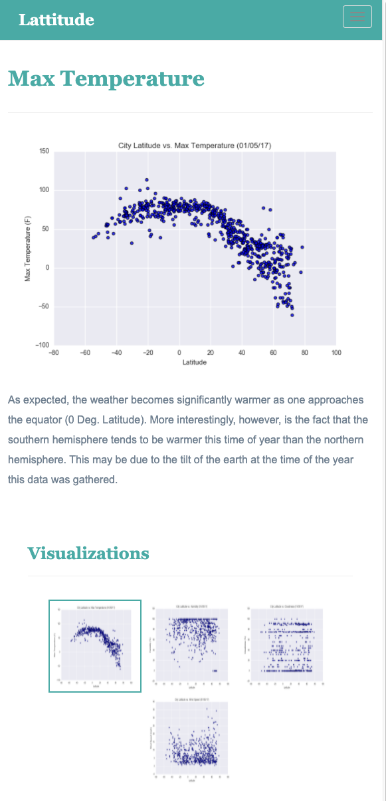

# Weather Visualizations Based on Latitude

## Background

In this project, data is used to visualize the weather of 500+ cities across the world of varying distance from the equator.
The visualizations created are then placed into a dashboard using HTML and CSS to demonstrate the analysis.

#### Landing page

Large screen:

Small screen:



#### Comparisons page

Large screen:

Small screen:

#### Data page

Large screen:

Small screen:

#### Visualization pages

You'll build four of these, one for each visualization. Here's an example of one:

Large screen:

Small screen:

#### Navigation menu

Large screen:

## References

OpenWeatherMap.org. (2012). Сurrent weather and forecast. Retrieved from [https://openweathermap.org/](https://openweathermap.org/)
